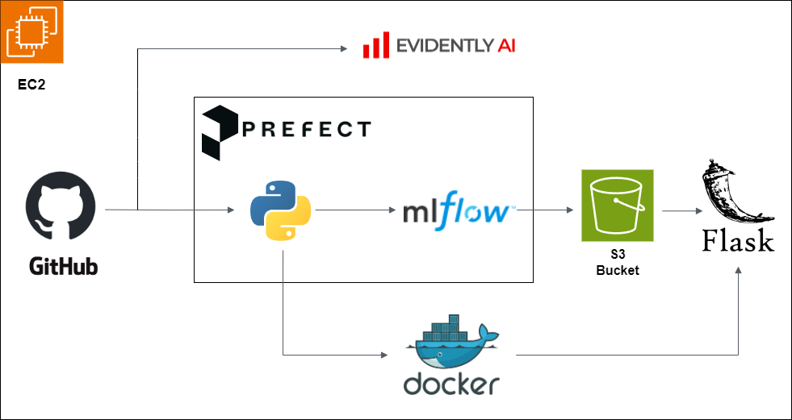

# Personalized Recipe Recommender

## Description

### Problem
In today's digital age, the sheer volume of available recipes can be overwhelming for individuals seeking to find dishes that align with their dietary preferences, tastes, and cooking skills. Traditional recipe search engines often lack personalization and fail to account for users' unique preferences, resulting in a time-consuming and frustrating search experience. A personalized recipe recommender system that understands individual user preferences and dietary restrictions can significantly enhance the cooking experience by providing tailored recipe suggestions.

### Project Objectives:
1. **Develop a Personalized Recipe Recommender System** - making use of the concepts of neural networks build a model that is capable of recommending recipes based on user preference.
	* ***Selected Model for the Project:*** Long short-term memory (LSTM)
	* ***Justification for Choosing LSTM:***
		1.	*Sequential Data Handling:* Recipes and procedures are sequences of words. LSTMs are designed to handle and learn from such sequential data, capturing dependencies between words effectively.
		2.	*Memory Capabilities:* LSTMs can remember information over long sequences, which is useful for understanding the context in a recipe's ingredients and procedures.
		3.	*Better for NLP Tasks:* LSTMs have been shown to perform well on various NLP tasks, including text generation and sequence prediction, making them ideal for understanding and generating recipe instructions.

2. **Identification of a Comprehensive Dataset & Data Handling:**
	* Selected Dataset:* The dataset exploited in this project is [RecipeNLG](https://www.kaggle.com/datasets/saldenisov/recipenlg) that is available on Kaggle. The dataset is rich in recipes, including ingredients, procedures, and named entity recognition (NER) for key elements.
	* Pre-processing: The selected dataset is extremely comprehensive with 2.2GB in size. This extremely huge dataset is not feasible to train on local computers. For this reason, a randomly selected subset of 50000 recipes has been extracted from the 1M+ recipes and the subset is used in this project.

3. **Implement Experiment Tracking & Model Registry:**
	* LSTM is trained on the selected dataset.
	* Model's hyperparameters have been tuned, where all experiments have been saved & tracked.
	* The best model is stored in the model registry for inference and predictions.
	* The performance metric dictating the selection of the best model is *Mean Absolute Error*.

4. **Machine Learning Workflow Orchestration:**
	* A workflow in ML is a sequence of tasks that runs subsequently in the machine learning process. It is ensured that the pipeline is robust and can handle data preprocessing, model training, evaluation, and deployment.

5. **Deploy the Model as a Web Service:**
	* The trained model is containerized using Docker. It is deployed on AWS EC2, ensuring it is accessible to users via a web interface. The web interface is a simple Flask application.

6. **Model Monitoring:**
	* Basic model monitoring that calculates and reports metrics like e.g., number of drifted columns, the drift score etc. has been included in this project. 

### Tools & Technologies

- Cloud - [**Amazon Web Services**](https://aws.amazon.com/)
- Containerization - [**Docker**](https://www.docker.com) and [**Docker Compose**](https://docs.docker.com/compose/)
- Workflow Orchestration - [**Prefect**](https://www.prefect.io/)
- Experiment Tracking & Model Management - [**MLflow**](https://mlflow.org/)
- Model Artifacts Storage - [**Amazon S3**](https://aws.amazon.com/s3/)
- Model monitoring - [**Evidently AI**](https://www.evidentlyai.com/)
- Language - [**Python**](https://www.python.org)

### Architecture

### Exploratory Data Analysis and Initial Model Training
The exploratory data analysis and initial model training is done in Jupyter a notebook. This notebook is available in the `notebooks` directory as [prr_data_prep_initial_model_training.ipynb](exploratory_data_analysis/prr_data_prep_initial_model_training.ipynb).

### Training Pipeline

### Experiment Tracking & Model Registry

### Model Storage

## Setup

**WARNING: You will be charged for all the infra setup. You can try free trials or 12 months free tier on AWS.**
### Pre-requisites

If you already have an Amazon Web Services account, you can skip the pre-requisite steps.

- Amazon Web Services: [AWS Account and Access Setup](setup/aws_account.md)

### Get Going

- SSH into your Virtual Machine (EC2 Instance) - [Setup](setup/ssh_ec2.md)
- Setup MLflow and Prefect on Virtual Machine to trigger the training pipeline - [Setup](setup/mlflow_prefect.md)
- Flask application deployment - [Setup](setup/deployment.md)
- Basic model monitoring - [Setup](setup/monitoring.md)

### Further Improvement

- Include proper and advanced model monitoring
- Use IaC tools for provisioning the infrastructure

### Special Mentions
I'd like to acknowledge the efforts of the [DataTalks.Club](https://datatalks.club) team for offering this MLOps course at absolutely no costs. There is no doubt about it that I have learnt a lot. This hands-on project enabled me to apply what I learnt during the course. [MLOps Zoomcamp](https://github.com/DataTalksClub/mlops-zoomcamp) a highly recommended course to everybody who is interested in developing their skills in MLOps technologies, please check out the 