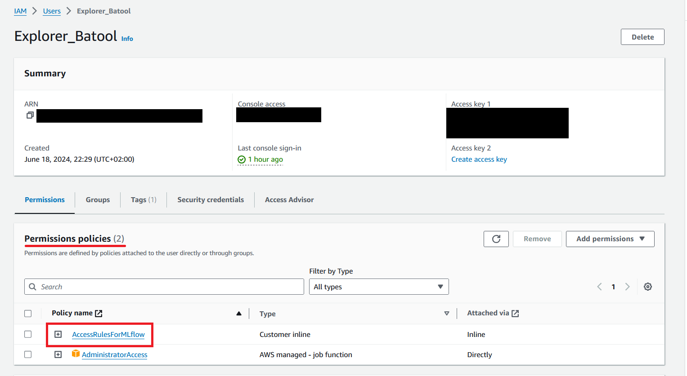

## IAM User Permissions for Modifying the S3 Bucket

- Login to your IAM user. 
- Navigate to the `Summary` page of your user. It would look something like 

	

- Now go to `Permissions` -> `Add permissions`
- Copy and past the JSON in as presented here

	```
	{
	    "Version": "2012-10-17",
	    "Statement": [
	        {
	            "Effect": "Allow",
	            "Action": [
	                "s3:PutObject",
	                "s3:GetObject",
	                "s3:DeleteObject"
	            ],
	            "Resource": "arn:aws:s3:::prr-mlops-project-mlflow-artifacts/*"
	        }
	    ]
	}
	```
- Save the permissions as `AccessRulesForMLflow`