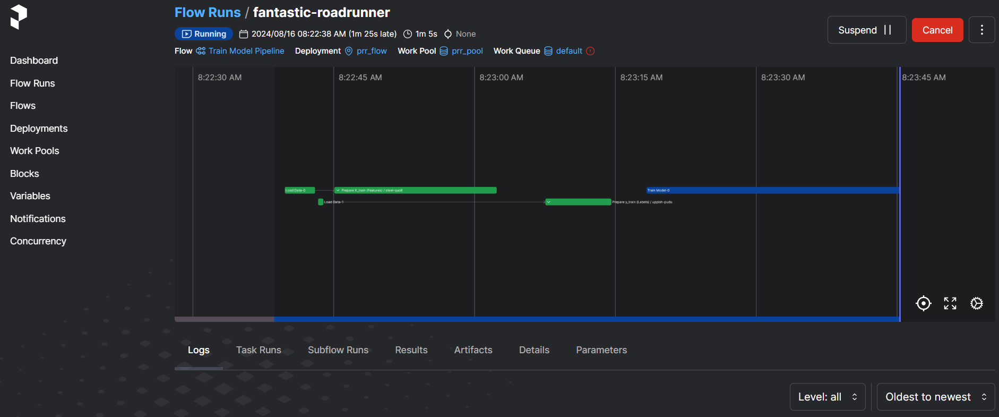
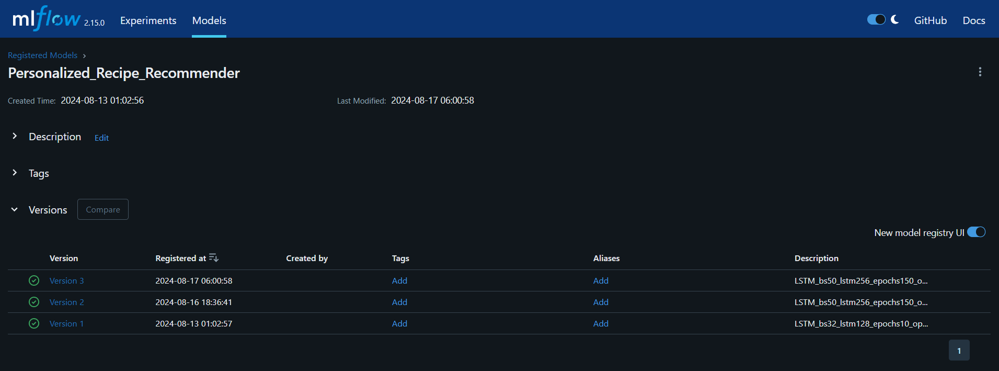
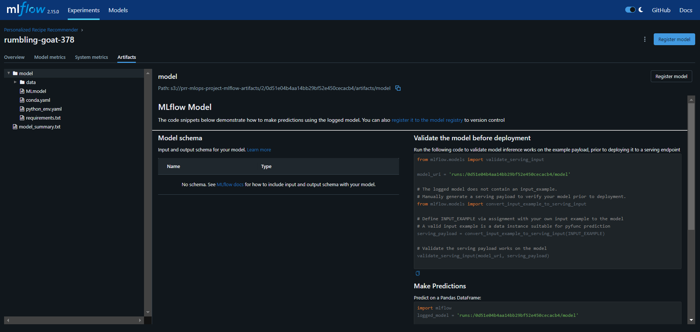

## MLflow & Prefect

***DAG Flow:***

  - TBD

Change directory to `training_orchestration` folder

```
cd ~/personalized_recipe_recommender/training_orchestration
```

Open a new terminal and run the following to start the MLflow tracking server

```
mlflow server --backend-store-uri sqlite:///mlflow.db --default-artifact-root s3://prr-mlops-project-mlflow-artifacts
```

Open a new terminal to start `prefect` server by executing

```
prefect server start
```

Open a new terminal. There are 2 options to run the training pipeline.

***Option 1:*** Run the prefect flow by directly invoking it via `python`

- Make sure that you are in `personalized_recipe_recommender/training_orchestration`. If unsure, run the command below.

	```
	cd ~/personalized_recipe_recommender/training_orchestration
	```

- From inside `personalized_recipe_recommender/training_orchestration`, run

	```
	python training_orchestartion.py
	```


***Option 2:*** Trigger Prefect flow

- For triggering the Prefect flow, make sure that you are in the project root folder. If unsure, run the command

    ```
    cd ~/personalized_recipe_recommender
    ```

- Start the Prefect worker in a separate terminal that pulls work from the `prr_pool` work pool. This can be done by executing

    ```
	prefect worker start --pool 'prr_pool'
    ```

- In a separate terminal, execute the following command to deploy the pipeline
    
	```
    prefect deploy training_orchestration/training_orchestration.py:main_flow -n prr_flow -p prr_pool
	```

- Run the ML model training and model registration pipeline
    
	```
    prefect deployment run 'Train Model Pipeline/prr_flow'
	```

A screenshot to show the Prefect deployment when it is running:



This next screenshot displays a completed Prefect deployment run:


Model's experiment training runs are observable the MLflow UI:


The outlook of MLflow's model registry is:



The training model's artifacts can be browsed through via the MLflow UI:



The training pipeline/ Prefect deployment stores the artifacts in S3 bucket:


